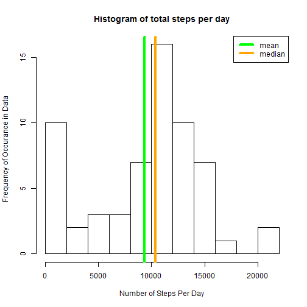

Reproducible Research: Peer Assessment 1
========================================

Kenneth Richlin
output: 
  html_document:
    keep_md: true


## Loading and preprocessing the data


```r
setwd("C:/Users/Kenneth/Desktop/RR_PA_1-master")

activityData <- read.csv(file = "activity.csv", sep =",", colClasses=c("integer","Date","integer"))
str(activityData)
```

```
## 'data.frame':	17568 obs. of  3 variables:
##  $ steps   : int  NA NA NA NA NA NA NA NA NA NA ...
##  $ date    : Date, format: "2012-10-01" "2012-10-01" ...
##  $ interval: int  0 5 10 15 20 25 30 35 40 45 ...
```

```r
summary(activityData)
```

```
##      steps             date               interval     
##  Min.   :  0.00   Min.   :2012-10-01   Min.   :   0.0  
##  1st Qu.:  0.00   1st Qu.:2012-10-16   1st Qu.: 588.8  
##  Median :  0.00   Median :2012-10-31   Median :1177.5  
##  Mean   : 37.38   Mean   :2012-10-31   Mean   :1177.5  
##  3rd Qu.: 12.00   3rd Qu.:2012-11-15   3rd Qu.:1766.2  
##  Max.   :806.00   Max.   :2012-11-30   Max.   :2355.0  
##  NA's   :2304
```


## What is mean total number of steps taken per day?

We can use tapply on the sum function to determine the mean number of steps taken per day.


```r
totalSteps <- tapply(activityData$steps, activityData$date, sum, na.rm=TRUE)
stepMean <- mean(totalSteps)
stepMean
```

```
## [1] 9354.23
```

```r
stepMedian <- median(totalSteps)
stepMedian
```

```
## [1] 10395
```

### Create a histogram of the total number of steps taken each day


```r
hist(totalSteps, breaks = 12,
     xlab = "Number of Steps Per Day",
     ylab = "Frequency of Occurance in Data",
     main = "Histogram of total steps per day")

abline(v=stepMean, col="green", lwd ="4")
abline(v=stepMedian, col="orange", lwd ="4")
legend(x = "topright", legend = c("mean", "median"), col=c("green","orange"), lwd = 4)
```



### Calculate and report the mean and median of the total number of steps taken per day

The mean number of steps taken each day is: 9354.2295082.
the median number of steps taken each day is: 10395.

## What is the average daily activity pattern?

Make a time series plot (ie, type = "l") of the 5 minute interval (x axis), and the average number of steps taken, averaged across all days (y-axis)

To get average steps per day, we aggregate the data by date


```r
library(plyr)
dailyActivity <- ddply(activityData, .(interval), summarize, steps = mean(steps, na.rm = TRUE))
with(dailyActivity, plot(interval, steps, type = "l"))
```


Which 5 minute interval, on average across all the days in the dataset, contains the maxiumum number of steps?


```r
maxSteps <- dailyActivity[which.max(dailyActivity$steps),]$interval
```

The maximum number of steps taken in a single 5 minute interval is `r maxSteps'.


## Imputing missing values

Find out how many data points are NA


```r
sum(is.na(activityData$steps))
```

```
## [1] 2304
```


Devise a strategy for filling in all of the missing values in the dataset.  We will substitute in the Average Daily Steps calculated above to fill the place of missing  values.  This will probalby have a smoothing effect on the data.


```r
stepValues <- data.frame(activityData$steps)
stepValues [is.na(stepValues),] <- ceiling(tapply(X=activityData$steps,INDEX=activityData$interval,FUN=mean,na.rm=TRUE))

newData <- cbind(stepValues, activityData[,2:3])
colnames(newData) <- c("Steps", "Date", "Interval")

summary(newData)
```

```
##      Steps             Date               Interval     
##  Min.   :  0.00   Min.   :2012-10-01   Min.   :   0.0  
##  1st Qu.:  0.00   1st Qu.:2012-10-16   1st Qu.: 588.8  
##  Median :  0.00   Median :2012-10-31   Median :1177.5  
##  Mean   : 37.45   Mean   :2012-10-31   Mean   :1177.5  
##  3rd Qu.: 27.00   3rd Qu.:2012-11-15   3rd Qu.:1766.2  
##  Max.   :806.00   Max.   :2012-11-30   Max.   :2355.0
```

Show the new imputed data in a histogram, including mean and median.  Same method as we used above, on the new dataframe.


```r
totalSteps2 <- tapply(newData$Steps, newData$Date, sum, na.rm=TRUE)
stepMean2 <- mean(totalSteps2)
stepMean2
```

```
## [1] 10784.92
```

```r
stepMedian2 <- median(totalSteps2)
stepMedian2
```

```
## [1] 10909
```

### Create a histogram of the total number of steps taken each day


```r
hist(totalSteps2, breaks = 12,
     xlab = "Number of Steps Per Day",
     ylab = "Frequency of Occurance in Data",
     main = "Histogram of total steps per day")

abline(v=stepMean2, col="green", lwd ="5")
abline(v=stepMedian2, col="orange", lwd ="3")
legend(x = "topright", legend = c("mean", "median"), col=c("green","orange"), lwd = 4)
```


Since we injected the mean many times over into the new data, the mean is now the most common entry, and dominates the median, skewing that particular metric.  Aside from that, the data does look to be smoothed out in some places.  It looks like the overall variance and standard deviation has decreased, with the first sigma falling in a much narrower range than previously observed.


## Are there differences in activity patterns between weekdays and weekends?


```r
newData$Weekend <- weekdays(newData$Date) == "Saturday" | weekdays(newData$Date) == "Sunday"

newData$Weekend <- factor(newData$Weekend, levels = c(F, T), labels = c("Weekday", "Weekend"))

activity <- ddply(newData, .(Interval, Weekend), summarize, steps = mean(Steps, na.rm = TRUE))

library(lattice)
xyplot(steps ~ Interval | Weekend, activity, type = "l", layout = c(1, 2), ylab = "Number of Steps", xlab = "Interval", main = "Weekend vs. Weekday activity patterns")
```


It looks like the activity is different on weekends.  Both series show a burst early in the day, however on weekdays the activity dies down at 10 AM.  This effect is much less pronounced on weekends, where activity seems to be more evenly spread throughout the day.

